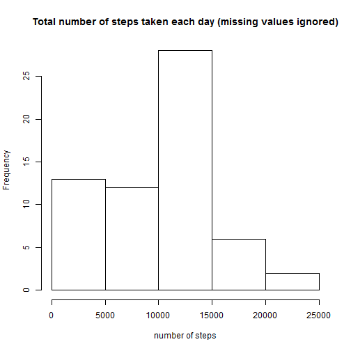
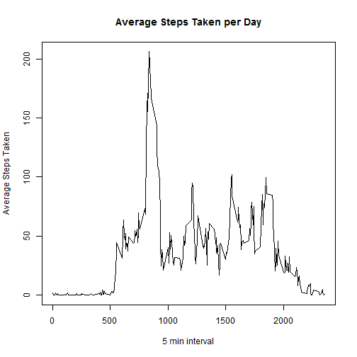
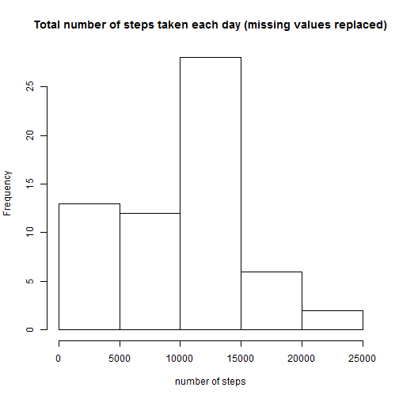
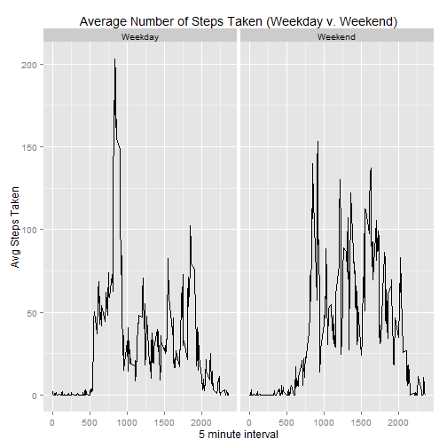

## Assignment

This assignment will be described in multiple parts. You will need to write a report that answers the questions detailed below. Ultimately, you will need to complete the entire assignment in a single R markdown document that can be processed by knitr and be transformed into an HTML file.

Throughout your report make sure you always include the code that you used to generate the output you present. When writing code chunks in the R markdown document, always use echo = TRUE so that someone else will be able to read the code. This assignment will be evaluated via peer assessment so it is essential that your peer evaluators be able to review the code for your analysis.

For the plotting aspects of this assignment, feel free to use any plotting system in R (i.e., base, lattice, ggplot2)

Fork/clone the GitHub repository created for this assignment. You will submit this assignment by pushing your completed files into your forked repository on GitHub. The assignment submission will consist of the URL to your GitHub repository and the SHA-1 commit ID for your repository state.

NOTE: The GitHub repository also contains the dataset for the assignment so you do not have to download the data separately.


### Loading and preprocessing the data

Show any code that is needed to:

1. Load the data (i.e. read.csv())
2. Process/transform the data (if necessary) into a format suitable for your analysis


```r
# Unzip Data
unzip(zipfile="activity.zip",exdir="./data")

# Read in data
activityData<-read.csv(file.path("data","activity.csv"),header=TRUE,sep=",")

# Convert 'date' varaible from factor to character
activityData$date <- sapply(activityData$date, as.character)
```


### What is mean total number of steps taken per day?

For this part of the assignment, you can ignore the missing values in the dataset.

1. Calculate the total number of steps taken per day
2. If you do not understand the difference between a histogram and a barplot, research the difference between them. Make a histogram of the total number of steps taken each day


```r
# Calculate total number of steps per day, ignore missing values
totalStepsPerDay <- tapply(activityData$steps, activityData$date, sum, na.rm=TRUE)

# Calculate Mean steps per day
stepsMean <- mean(totalStepsPerDay)

# Calculate Median steps per day
stepsMedian <- median(totalStepsPerDay)

# Generate histogram of total number of steps taken per day
hist(totalStepsPerDay, xlab="number of steps", main="Total number of steps taken each day (missing values ignored)")
```

 


3. Calculate and report the mean and median of the total number of steps taken per day

**The mean of the total number of steps taken each day is 9354.2295082.**

**The median of the total number of steps taken each day is 10395.**


### What is the average daily activity pattern?
1. Make a time series plot (i.e. type = "l") of the 5-minute interval (x-axis) and the average number of steps taken, averaged across all days (y-axis)


```r
# Calculate average number of steps taken, averaged across all days
totalStepsPerInterval<-tapply(activityData$steps, activityData$interval, mean, na.rm=TRUE)

# Generate time-series plot
plot(unique(activityData$interval),totalStepsPerInterval,type="l",xlab="5 min interval",ylab="Average Steps Taken",main="Average Steps Taken per Day")
```

 


2. Which 5-minute interval, on average across all the days in the dataset, contains the maximum number of steps?


```r
# Get 5-minute interval containing maximum number of steps
max5minInterval<-names(which.max(totalStepsPerInterval))
```

**The 5-minute interval that, on average, contains the maximum number of steps is 835**


### Imputing missing values

Note that there are a number of days/intervals where there are missing values (coded as NA). The presence of missing days may introduce bias into some calculations or summaries of the data.

1. Calculate and report the total number of missing values in the dataset (i.e. the total number of rows with NAs)


```r
# Calculate and report the total number of missing values (any observations with missing values) in the dataset
totalMissing<-sum(is.na(activityData$steps))
```

**The total number of observations with missing values is 2304.**

2. Devise a strategy for filling in all of the missing values in the dataset. The strategy does not need to be sophisticated. For example, you could use the mean/median for that day, or the mean for that 5-minute interval, etc.

**We know that every day contains 288 observations since samples are taken at 5 minute intervals. The variable 'whereMissing' tells us which observations (row number of activityData) have missing values.**

**The command 'ceiling([1...288]/288)' will produce an array of 1s, corresponding to observations from the first day.**

**The command 'ceiling([289...576]/288)' will produce an array of 2s, corresponding to observations from the second day, etc.**

**Finally we use the daily average contained in the variable 'avgStepsPerDay' created above to replace missing values.**


```r
# Calculate the average number of steps taken per interval each day (this value will be used to replace missing values)
avgStepsPerDay <- totalStepsPerDay/length(unique(activityData$interval))

# Find data observations with missing values
whereMissing <- which(is.na(activityData$steps))

# Get replacement values (average steps per interval each day) specific to date
replacementValues <- as.numeric(avgStepsPerDay[ceiling(whereMissing/288)])
```

3. Create a new dataset that is equal to the original dataset but with the missing data filled in.
4. Make a histogram of the total number of steps taken each day and Calculate and report the mean and median total number of steps taken per day. Do these values differ from the estimates from the first part of the assignment? What is the impact of imputing missing data on the estimates of the total daily number of steps?


```r
# Create copy of data, replace missing values
activityData_naReplace <- activityData
activityData_naReplace$steps[is.na(activityData_naReplace$steps)] <- replacementValues

# Calculate total number of steps per day with imputed data
totalStepsPerDayREPLACE <- tapply(activityData_naReplace$steps, activityData_naReplace$date, sum)

# Calculate Mean steps per day
stepsMeanReplace <- mean(totalStepsPerDayREPLACE)

# Calculate Median steps per day
stepsMedianReplace <- median(totalStepsPerDayREPLACE)

# Generate histogram of total number of steps taken per day
hist(totalStepsPerDayREPLACE, xlab="number of steps", main="Total number of steps taken each day (missing values replaced)")
```

 


**The mean of the total number of steps taken each day (NAs ignored) is 9354.2295082.**

**The mean of the total number of steps taken each day (NAs replaced) is 9354.2295082.**

**The median of the total number of steps taken each day (NAs ignored) is 10395.**

**The median of the total number of steps taken each day (NAs replaced) is 1.0395 &times; 10<sup>4</sup>.**

**The mean and median of the total number of steps taken per day has not changed. This was expected since we replaced missing values with the mean of values during that given day.**


### Are there differences in activity patterns between weekdays and weekends?

For this part the weekdays() function may be of some help here. Use the dataset with the filled-in missing values for this part.

1. Create a new factor variable in the dataset with two levels - "weekday" and "weekend" indicating whether a given date is a weekday or weekend day.


```r
# Convert date variable to day of the week (string representation)
dayType <- weekdays(as.Date(activityData_naReplace$date,"%Y-%m-%d"))

# Find where weekends occur, clear dayType variable, add Weekend/Weekday designation
weekendsLogic <- (dayType=="Saturday" | dayType=="Sunday")
dayType <- NULL
dayType[weekendsLogic] <- "Weekend"
dayType[!weekendsLogic] <- "Weekday"

# Convert "dayType" to factor, add to data set
activityData_naReplace$dayType <- as.factor(dayType)
```

2. Make a panel plot containing a time series plot (i.e. type = "l") of the 5-minute interval (x-axis) and the average number of steps taken, averaged across all weekday days or weekend days (y-axis). See the README file in the GitHub repository to see an example of what this plot should look like using simulated data.


```r
# Summarize data as the average number of steps taken based on interval and dayType
summaryData <- aggregate(steps ~ interval+dayType, activityData_naReplace, mean)

# Load ggplot2 library, plot data
library(ggplot2)
qplot(interval,steps,data=summaryData,type="l",facets=.~dayType,geom = c("line"),xlab="5 minute interval",ylab="Avg Steps Taken",main="Average Number of Steps Taken (Weekday v. Weekend)")
```

 
